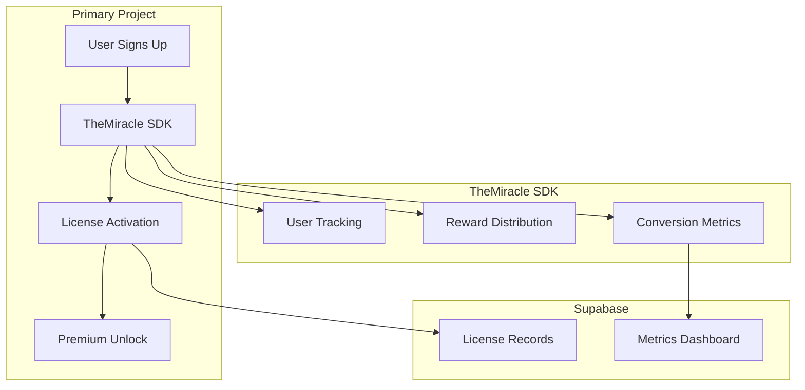

# Mircle — Technical Architecture

## System Architecture



## Tech Stack

| Layer | Technology |
|---|---|
| **Frontend** | Primary project stack |
| **Incentive** | TheMiracle SDK |
| **Database** | Supabase |

## TheMiracle SDK Integration Map

| Feature | Use Case | Depth |
|---|---|---|
| **User Tracking** | Track sign-up source and conversion | 🟢 Core |
| **Reward Distribution** | Issue "Lifetime Pro" license | 🟢 Core |
| **Metrics API** | Signups, activations, retention | 🟢 Core |

## Database Schema

```sql
CREATE TABLE licenses (
    id UUID PRIMARY KEY DEFAULT gen_random_uuid(),
    wallet TEXT NOT NULL UNIQUE,
    license_type TEXT DEFAULT 'lifetime_pro',
    activated_at TIMESTAMPTZ DEFAULT NOW(),
    source TEXT DEFAULT 'themiracle'
);
```

## API Routes

| Method | Path | Description |
|---|---|---|
| POST | `/api/activate` | Activate Lifetime Pro license |
| GET | `/api/metrics` | Dashboard: signups, activations |
